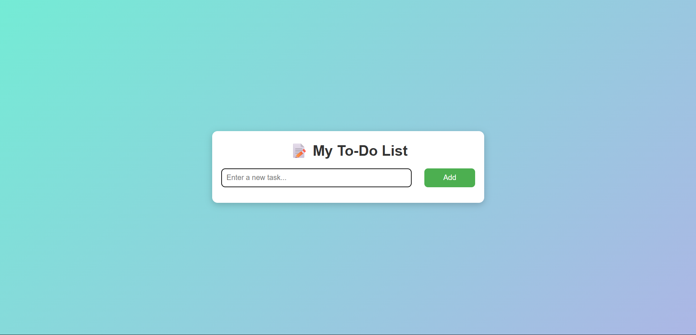
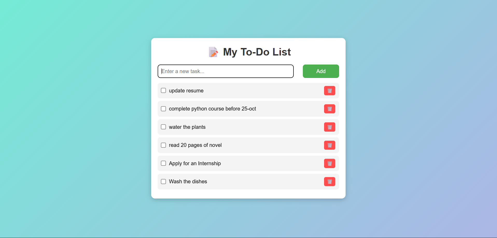
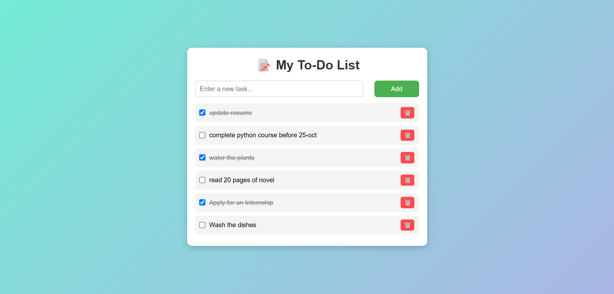

# To-Do List Web App

A simple, interactive To-Do List built using **HTML, CSS, and Vanilla JavaScript**.

## Features
- Add, complete, and delete tasks dynamically
- Instant UI updates without reloading
- Clean and responsive interface

## Tools Used
- HTML5
- CSS3
- JavaScript (ES6)
- VS Code + Live Server

## How to Run
1. Clone the repo or download the files.
2. Open `index.html` in VS Code.
3. Right-click → “Open with Live Server”.

   ## 📸 Preview

---

### Author
**Shreya V K**
